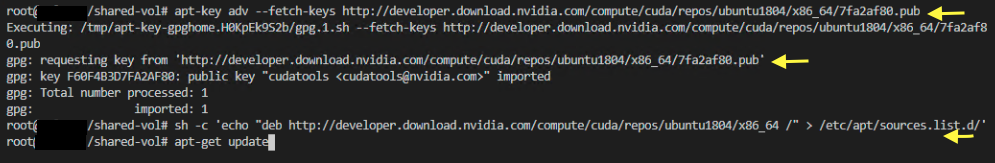
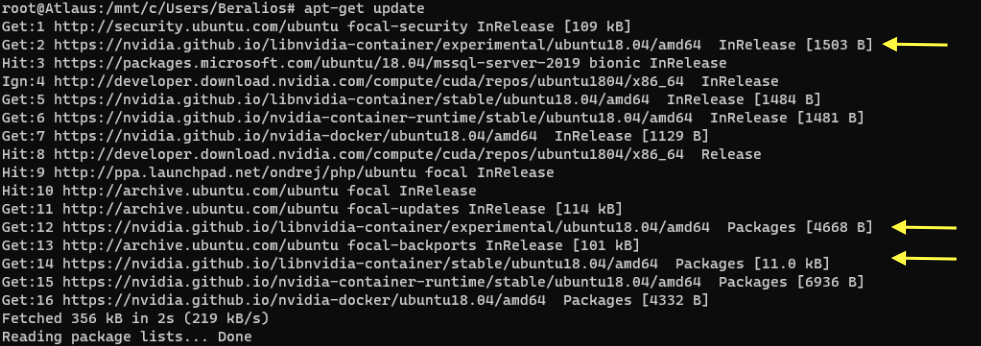
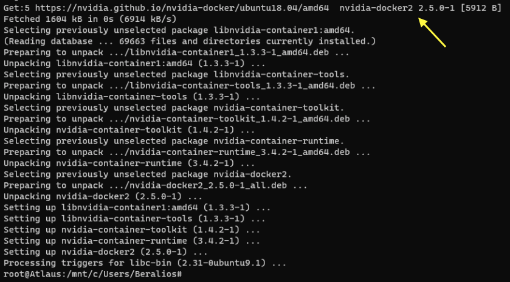
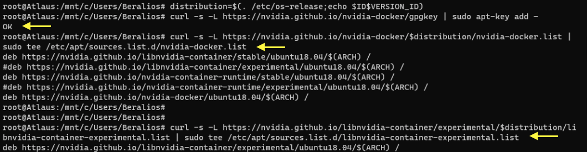
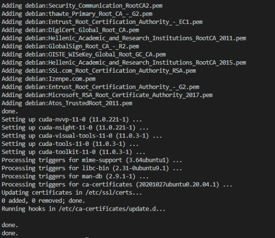
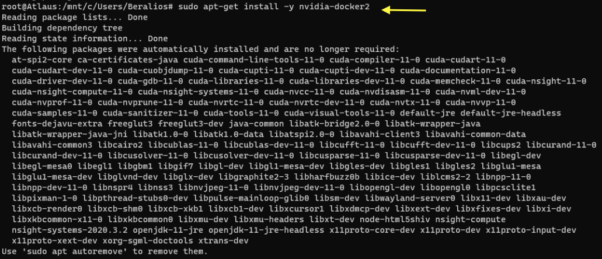
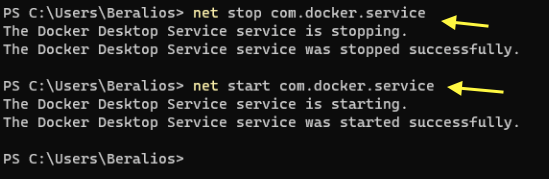
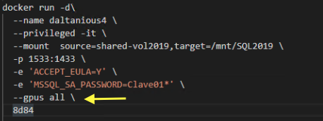

# Using NVidia CUDA Toolkit for SQL Server in Containers in WSL2.  

NVidia has developed the CUDA Toolkit library designed for developers, aimed to efficiently use the hardware resources. The CUDA Toolkit provides a different set of tools as well as programming guidelines for the different programming languages for the interoperability with the hardware.

Now NVida has released in the **v11.2.1** a surprise that is a  **CUDA on WSL**.
This feature is designed for the **WSL Images** to use of the **GPU's** resource.
This is a great impowering for **NVIDIA  users** to utilize their resources in their **Windows Subsystem Linux** boxes.


## Setting up the CUDA Toolkit

**First** we will Open the Windows Terminal and get inside the WSL default box that we require to configure.

**NOTE: This example is configured for distributions based on Apt.**
Because the purpose for this excersise is to configure SQL Server in Containers using WSL2, then the distro to use here is Ubuntu, so that the Apt will work here.

**Secondly** will configure the CUDA repository keys and update the list to re 

``` code bash
wsl

$> apt-key adv --fetch-keys http://developer.download.nvidia.com/compute/cuda/repos/ubuntu1804/x86_64/7fa2af80.pub

$> sh -c 'echo "deb http://developer.download.nvidia.com/compute/cuda/repos/ubuntu1804/x86_64 /" > /etc/apt/sources.list.d/cuda.list'

$> apt-get update

```



Once the package tree is up to date, the package process begins by installing the cuda-toolkit-version dedicated for WSL instead of the tipically designed package for the NVIDIA driver as follows:

``` code bash
$> apt-get install -y cuda-toolkit-11-0

```


Unpacking the drivers




## Setting Up CUDA Toolkit in WSL2

Now it is necesary to set the variable identifying the O.S. Version followed by the download of the docker and nvidia libraries for WSL2.


``` code bash
$> distribution=$(. /etc/os-release;echo $ID$VERSION_ID)
$> curl -s -L https://nvidia.github.io/nvidia-docker/gpgkey | sudo apt-key add -
$> curl -s -L https://nvidia.github.io/nvidia-docker/$distribution/nvidia-docker.list | sudo tee /etc/apt/sources.list.d/nvidia-docker.list
$> curl -s -L https://nvidia.github.io/libnvidia-container/experimental/$distribution/libnvidia-container-experimental.list | sudo tee /etc/apt/sources.list.d/libnvidia-container-experimental.list

```

Installing CUDA on WSL2



Placing the libraries and certificates




## Configuring CUDA in WSL2 

Now that the toolkit library its installed in the environment (WSL2), we are ready to prepare the CUDA in the Containers. 
 
We are moving into Containerized environment, the NVIDIA CUDA libraries also helps this scenario. In this enviroment using the help of Docker administrated by WSL2 

``` code bash
$> sudo apt-get update
$> sudo apt-get install -y nvidia-docker2

```
Installing the runtime packages in docker.



Now it is time to restart the Docker services, for this a new Windows Terminal tab can be opened and set it as PowerShell profile.

``` code Powershell
PS> net stop com.docker.service

PS> net start com.docker.service
```



## Using CUDA in SQL Server Containers

Finally we've made it! We can configure a SQL Server Container using all NVIDIA GPUS.

**Considerations:** To create this container, I've used a different port in port forwarding from host machine, also have declared in explicit parameter the MSSQL_SA_PASSWORD instead of SA_PASSWORD, as this have change from older SQL images.

``` code bash
docker run -d\
 --name daltanious 4 \
 --privileged -it \
 --mount source=shared-vol2019,target=/mnt/SQL2019 \
 -p 1533:1433 \
 -e 'ACCEPT_EULA=Y'
 -e 'MSSQL_SA_PASSWORD=Clave01*' \
 --gpus all \
 8d84
```



We have come to the conclusion of this excersise, if you wish to go further in the use of the CUDA Toolkit documentation, you can read along the [CUDA Toolkit Documentation](https://docs.nvidia.com/cuda/index.html).