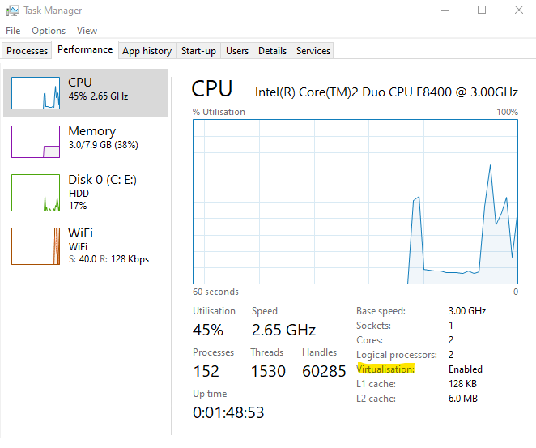
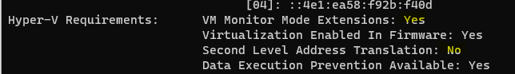
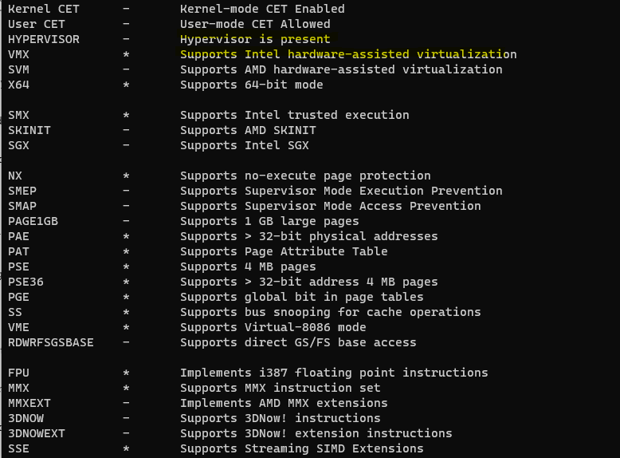
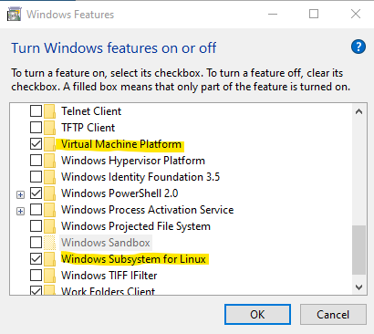
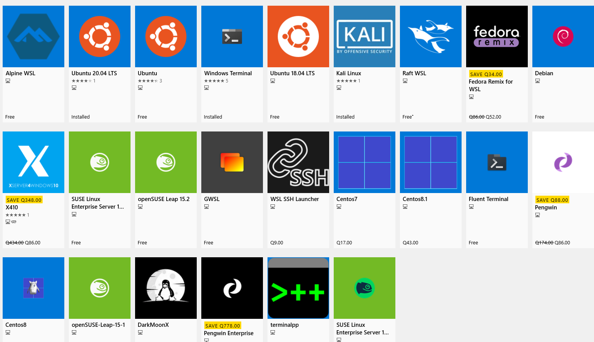
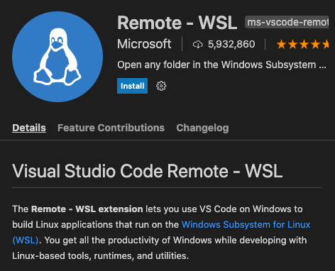
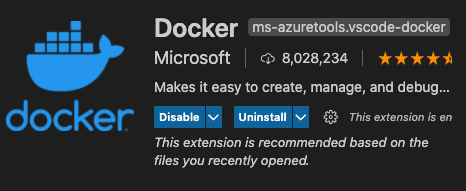
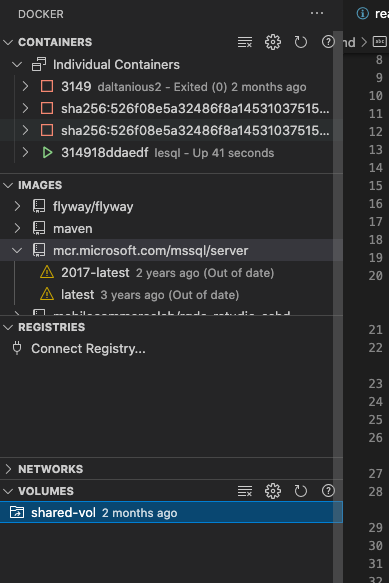
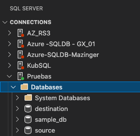

# How to Configure WSL for Containers

The Windows Subsystem Linux version 2 feature allows the integration of different Linux distributions to be managed in Windows through the hyper-v hypervisor. The WSL2 difference than just being merely virtual machines, this feature allows a ***real integration*** with Windows host O.S. by accesing the resources, accessing Windows API's, allowing executing bash shells, and having full compatilibity with Windows O.S. kernel.

## Requirements for WSL

+ 64 Bit Windows 10.04 O.S.

+ VT-X Bios Enabled

+ Virtual Machine Platform feature enabled

+ (Additionally) Docker Requirements:
    
    + SLT or Second Level Adress Translation


### How to Check?

There are certian methods in Windows perspective to identify the virtualisation method. Here are some aproaches:

1. From Taskmgr.exe->Performance->CPU we can rapidly check for "Virtualisation Enabled"



2. Using the systeminfo tool detailing, we look into "Hyper-V Requirements"

**NOTE: In this particular scenario will allow installing WSL2 but Docker won't run because SLT**



3. Using the coreinfo [sysinternals tool](https://www.google.com/url?sa=t&rct=j&q=&esrc=s&source=web&cd=&cad=rja&uact=8&ved=2ahUKEwiD4I2w_L_vAhWItVkKHVTgD6UQFjAAegQIAxAD&url=https%3A%2F%2Fdocs.microsoft.com%2Fen-us%2Fsysinternals%2Fdownloads%2Fcoreinfo&usg=AOvVaw1_22XCO4LmTn60dR_vdUf7), we can look into coreinfo 



## Configure WSL Feature

Now we will use the help of the Deployment Image Servicing and Management tool for enabling the feature in the system.
NOTE: Remember you need a valid version of Operative System and hardware requirements for using the feature.

``` code Powershell

dism.exe /online /enable-feature /featurename:Microsoft-Windows-Subsystem-Linux /all /norestart

```

## Upgrade to WSL2

Now that you have enable the feature let's upgrade it to version 2 and place it as default versioning.

``` code Powershell

wsl --set-default-version 2

```

## Enable Virtual Administration

We need to verify that this VM feature is enabled in the O.S., You have two ways to do it:
By code you can execute:

``` code Powershell
dism.exe /online /enable-feature /featurename:VirtualMachinePlatform /all /norestart

```
Or you can go to GUI Windows Features->Add

**NOTE** The WSL feature will apear on Windows Features if you have already previously installed.



**NOTE:** You don't need to have Hyper-V administration enabled, but you need just the basic configurations
for WSL to work.


## Verify Docker WSL2 and requirements

### Harware
+  (At least) 4 GB RAM
+  CPU 2 Core
+  VT-X Bios Technology
    + SLT or Second Level Adress Translation
### O.S.
+ 32 - 64 Operative System (however WSL requires 64)

## Install Linux distro box

Here are 2 examples to install 2 distros, I've selected Ubutu and Suse due these are supported to install SQL Server in them.

For Ubuntu 
``` code powershell

PS> Invoke-WebRequest -Uri https://aka.ms/wsl-ubuntu-1604 -OutFile Ubuntu.appx -UseBasicParsing

# Using Curl method #

PS> curl.exe -L -o ubuntu-1604.appx https://aka.ms/wsl-ubuntu-1604

```
For Suse

``` code powershell
# Ading the package to market #
PS>  Add-AppxPackage .\openSUSE-Leap-15.1-x64-Build7.19.appx
# Using Curl method #
PS> curl.exe -L -o openSUSE-Leap-15.1-x64-Build7.19.appx http://download.opensuse.org/repositories/Virtualization:/WSL/openSUSE_Leap_15.1

```

Here you can find the market all distros you can install.




## Configure WSL in Docker


## Download Docker SQL Server Images

Now we will use Docker Pull command to download
images to our Docker system, finding the complete list in the [SQL Server Docker Hub](https://hub.docker.com/_/microsoft-mssql-server)

Here are the images published in Docker Hub and the code related:

```Code 

docker pull mcr.microsoft.com/mssql/server:2017-latest

docker pull mcr.microsoft.com/mssql/server:2019-latest

docker pull mcr.microsoft.com/mssql/server:2017-CU22-ubuntu-16.04

docker pull mcr.microsoft.com/mssql/server:2019-CU9-ubuntu-16.04

```


## Checking your Docker Images to use


## Create SQL Containers

Now we will dedicate to build our Docker run for initial containers:

### Using Docker run for SQL 2017
The following container it's an initial example for parameters:
    
+ The bellow Docker run command shows the use of volume local share and container path location   

```Code Docker 

docker run -d -p 1433:1433 --name Daltanious \ 
--privileged -it -e "SA_PASSWORD=Clave01*" -e "ACCEPT_EULA=Y" \
--volume /mnt/c/Users/Beralios/Desktop/SQLBackups:/mnt/share\
-e "SA_PASSWORD=Clave01*" -e "ACCEPT_EULA=Y" d04f

```
+ The below Docker run command shows the use of mount option by creating a Shared volumen defined

```Code Docker

docker run -d -p 1433:1433 --name Daltanious --privileged -it \
 --mount type=bind,src='shared-vol',dst='/mnt/SQL' -v   -e "SA_PASSWORD=Clave01*"\
 -e "ACCEPT_EULA=Y" d04f

```
+ The below Docker run command shows the use of mount parameter defining source at Windows local host path with Linux Syntax and destiny
 **Note** that the 'src' and dst path notation depends if you are executing on WSL or Powershell environment.

```Code Docker

docker volume create shared-vol

docker run -d -p 1433:1433 --name Daltanious --privileged -it   -e "SA_PASSWORD=Clave01*" \
 -e "ACCEPT_EULA=Y" --mount type=bind,src=/mnt/c/Users/Beralios/Desktop, dst=/mnt/SQLBackups d04f

```
The containers that have been created can be monitored listing them as follows:

The Images that you have pulled from the Docker Hub, can be detailed as follows:


### Using Docker Build - Image

1) Create a docker file and save in local environment as detailed example: 

**NOTE**: The mount parameter and bind depends on your configuration.  
```Docker build
#Take Image from SQL Server
#Choose bewteen
#2019-latest
#2017-latest
FROM mcr.microsoft.com/mssql/server:2017-latest

#containing personal instructions.
#COPY testfile.txt .
RUN -d -p 1433:1433 --name Daltanious --privileged -it \
 --mount type=bind,src='shared-vol',dst='/mnt/SQL' -e "SA_PASSWORD=Clave01*"\
 -v sqlvolume:/var/opt/mssql\
 -e "ACCEPT_EULA=Y" d04f
LABEL "name"="Daltanious"
#Copying the SQL Backups
COPY mnt/c/Users/Beralios/Desktop/SQLBackups/*  /mnt/SQL/

```
2) Build your Image as follows:
```Docker build
docker build  . - < Dockerfile

```
**Note** if you are on Powershell
```Docker build 

Get-Content Dockerfile | docker build -
```
## Tools and Features

+ Visual Studio Code - WSL  Extension (ms-vscode-remote)



Open Windows Terminal or Powershell and 
1) verify the WSL box you want to set in
2) open the VSC by running the code command with remote parameter

***Set WSL 2 VSCode extension, SQL Server extension***


```Code Powershell
wsl -l -v
wsl -s Ubuntu-20.04
code --remote wsl+Ubuntu-20.04

```
You can have additional visual support by setting up
+ ms-azuretools.vscode-docker
+ ms-mssql




So you can look at things like this...





